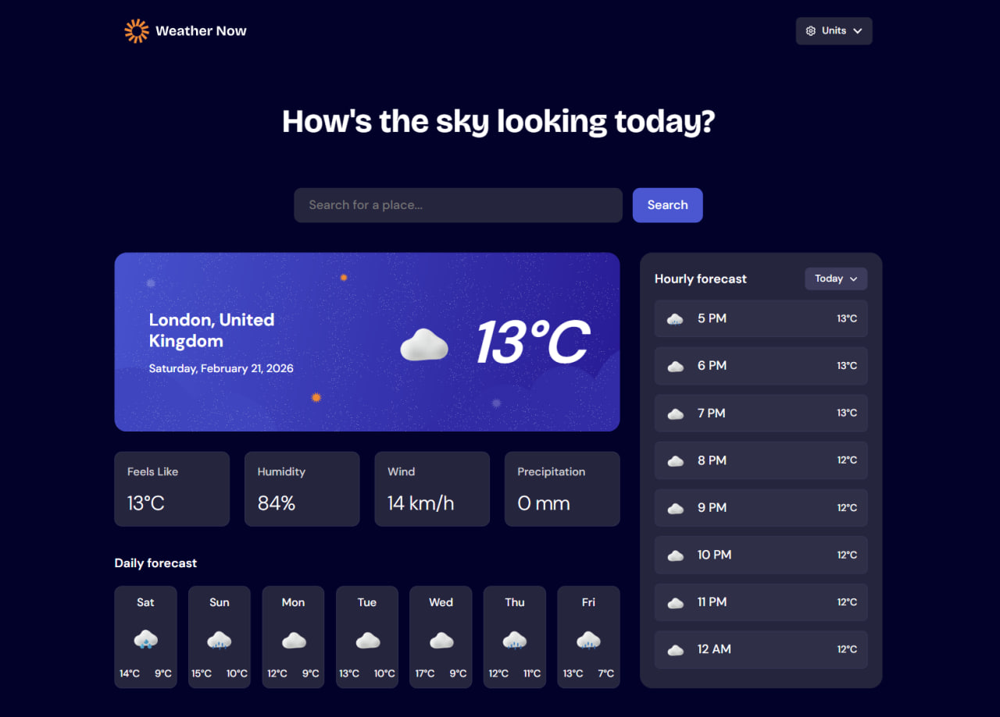

# Weather App

## Table of contents

- [Overview](#overview)
  - [The challenge](#the-challenge)
  - [Screenshot](#screenshot)
  - [Link](#link)
- [My process](#my-process)
  - [Built with](#built-with)
  - [What I learned](#what-i-learned)
  - [Continued development](#continued-development)
  - [Useful resources](#useful-resources)
- [Author](#author)

## Overview

### The challenge

Users should be able to:

- Search for weather information by entering a location in the search bar,
- View current weather conditions including temperature, weather icon, and location details,
- See additional weather metrics like "feels like" temperature, humidity percentage, wind speed, and precipitation amounts,
- Browse a 7-day weather forecast with daily high/low temperatures and weather icons,
- View an hourly forecast showing temperature changes throughout the day,
- Switch between different days of the week using the day selector in the hourly forecast section,
- Toggle between Imperial and Metric measurement units via the units dropdown,
- Switch between specific temperature units (Celsius and Fahrenheit) and measurement units for wind speed (km/h and mph) and precipitation (millimeters) via the units dropdown,
- View the optimal layout for the interface depending on their device's screen size,
- See hover and focus states for all interactive elements on the page.

### Screenshot

### Link

- Live Site URL: [https://tiaranella.github.io/Weather-App/]

## My process

### Built with

- Semantic HTML5 markup
- CSS custom properties
- Flexbox & CSS Grid
- Desktop-first workflow
- Vanilla JavaScript (ES6+)
- [Open-Meteo API](https://open-meteo.com/) - For handling geocoding and weather data retrieval

### What I learned

Here are the main things I focused on and learned while building this project:

- **Vanilla JavaScript:** I built the entire app without using any external frameworks. This helped me understand the core logic behind important helper functions, like debouncing and caching, to make the app run faster and smoother,
- **ES6 Modules & Encapsulation:** I separated my code into smaller, independent ES6 modules. This made the project much easier to read, maintain, and debug compared to having one massive global script file,
- **API Data Fetching:** I used asynchronous functions (`async/await`) to get weather and location data from the Open-Meteo API. I also learned how to use LocalStorage to save the user's last searched city and unit choices so the app remembers them,
- **Autocomplete Search:** I built a custom search bar that suggests city names as the user types. This taught me how to handle user input events and display matching results in a list below the search bar,
- **Dynamic Dropdown Menus:** I created custom dropdown menus for picking units of measurement and days of the week. Instead of just making them open and close, I learned how to instantly update the weather data and metrics on the page whenever a user selects a different option.

### Continued development

In future updates, I plan to focus on:
- **Error Handling:** Improving UI feedback when a user searches for an invalid city or when the Open-Meteo API experiences downtime,
- **Accessibility (A11y):** Ensuring all custom dropdowns, search inputs, and dynamic content elements are fully accessible via keyboard navigation and screen readers (implementing proper ARIA attributes).

### Useful resources

- [State Management in Vanilla JS](https://dev.to/godofgeeks/state-management-in-vanilla-js-51dg) - This article provided great insights into managing application state effectively without relying on large external frameworks.
- [How to Use Fetch with async/await](https://dmitripavlutin.com/javascript-fetch-async-await/) - A clear and helpful guide that improved my understanding of handling asynchronous JavaScript and API requests.
- [Open-Meteo API Documentation](https://open-meteo.com/en/docs) - This free API was nice to use because it doesn't require an API key, so it making frontend-only deployment incredibly easy,
- [GitHub Pages Deployment Guide](https://pages.github.com/) - Helped me understand how to host a static Vanilla JS site directly from a repository and troubleshoot pathing issues,
- [MDN Web Docs: ES6 Modules](https://developer.mozilla.org/en-US/docs/Web/JavaScript/Guide/Modules) - A great reference that helped me understand how to properly encapsulate my JavaScript code using `import` and `export`.

## Author

- GitHub - [tiaranella](https://github.com/tiaranella)

