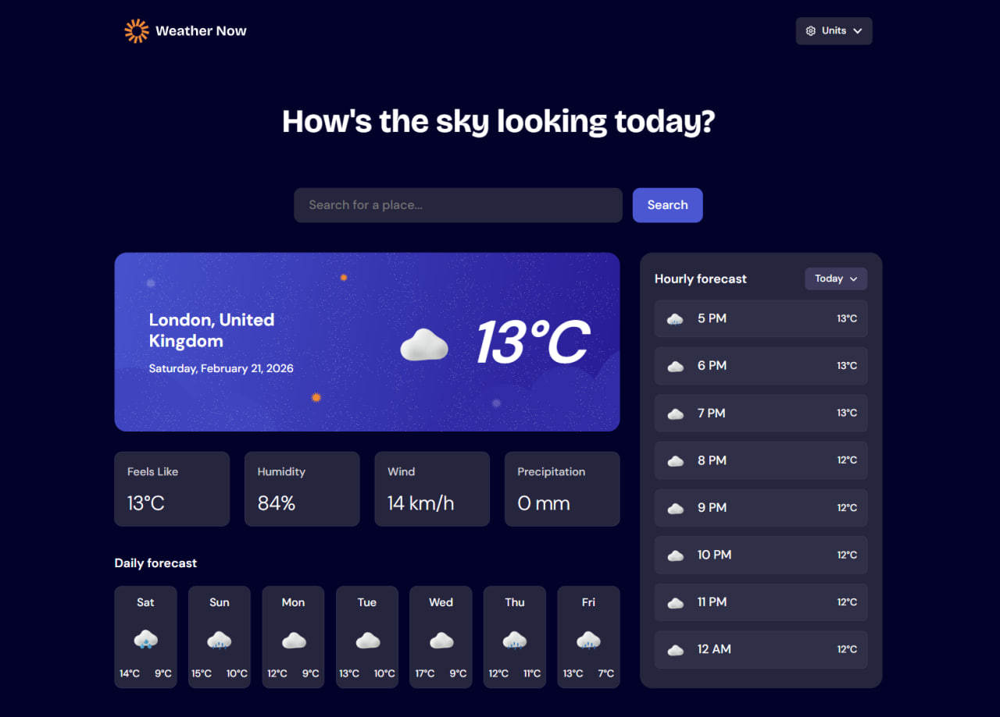

# Weather App

## Table of contents

- [Overview](#overview)
  - [The challenge](#the-challenge)
  - [Screenshot](#screenshot)
  - [Link](#link)
- [My process](#my-process)
  - [Built with](#built-with)
  - [What I learned](#what-i-learned)
  - [Continued development](#continued-development)
  - [Useful resources](#useful-resources)
- [Author](#author)

## Overview

### The challenge

Users should be able to:

- Search for weather information by entering a location in the search bar,
- View current weather conditions including temperature, weather icon, and location details,
- See additional weather metrics like "feels like" temperature, humidity percentage, wind speed, and precipitation amounts,
- Browse a 7-day weather forecast with daily high/low temperatures and weather icons,
- View an hourly forecast showing temperature changes throughout the day,
- Switch between different days of the week using the day selector in the hourly forecast section,
- Toggle between Imperial and Metric measurement units via the units dropdown,
- Switch between specific temperature units (Celsius and Fahrenheit) and measurement units for wind speed (km/h and mph) and precipitation (millimeters) via the units dropdown,
- View the optimal layout for the interface depending on their device's screen size,
- See hover and focus states for all interactive elements on the page.

### Screenshot

### Link

- Live Site URL: [https://tiaranella.github.io/Weather-App/]

## My process

### Built with

- Semantic HTML5 markup
- CSS custom properties
- Flexbox & CSS Grid
- Desktop-first workflow
- Vanilla JavaScript (ES6+)
- [Open-Meteo API](https://open-meteo.com/) - For handling geocoding and weather data retrieval

### What I learned

Here are the main things I focused on and learned while building this project:

- **Modular Architecture ES6+ for better State Management:** I structured the application using ES6 modules by separating into components and utility functions to keep the codebase clean and maintainable. I managed the application state centrally within a main App class. By passing the states down to individual components, it's been achieved data flow and seamless UI updates without relying on external frameworks,
- **Asynchronous JavaScript and fetch:** I expanded my knowledge of asynchronous operations by fetching weather data from the Open-Meteo API. Using `async/await` together with the Fetch API, I also learned how to implement `AbortController` to handle timeout scenarios, which allows multiple fetch calls to be canceled simultaneously. This improves performance for frequent requests by canceling the previous request (which has not yet completed) so that it does not send unnecessary requests,
- **Dynamic Toggle Menus with Content Changing:** Created complex interactive drop-down menus for switching units of measurement and selecting different days of the week. Learned how to intercept user clicks, instantly update status, and call callback functions that dynamically update components on the page without completely reloading the browser,
- **Skeleton Loading:** To improve the perceived performance of the app, I implemented a modern skeleton loading state. Using CSS `@keyframes` to create a shimmer effect, I applied `.skeleton` classes to UI containers before the API data finishes fetching,
- **Autocomplete & Debouncing:** I created a custom search bar that suggests city names as the user types using the Geocoding API. To solve the issue of firing too many network requests, I implemented a "debounce" technique using `setTimeout` and `clearTimeout`. This delays the API call until the user stops typing, which optimizes performance and prevents rate-limiting the API.

### Continued development

In future updates, I plan to focus on:
- **Error Handling:** Improving UI feedback when a user searches for an invalid city or when the Open-Meteo API experiences downtime,
- **Accessibility (A11y):** Ensuring all custom dropdowns, search inputs, and dynamic content elements are fully accessible via keyboard navigation and screen readers.

### Useful resources

- [State Management in Vanilla JS](https://dev.to/godofgeeks/state-management-in-vanilla-js-51dg) - This article provided great insights into managing application state centrally with vanilla JS,
- [MDN Web Docs: AbortController](https://developer.mozilla.org/en-US/docs/Web/API/AbortController) - A crucial resource that helped me understand how to properly abort web requests and create custom timeout utility functions,
- [How to Use Fetch with async/await](https://dmitripavlutin.com/javascript-fetch-async-await/) - A clear guide that improved understanding of handling asynchronous JavaScript and external API requests,
- [Building Skeleton Screens with CSS](https://css-tricks.com/building-skeleton-screens-css-custom-properties/) - This helped me figure out how to create the animated shimmer effect for my loading states,
- [Understanding Debounce in JavaScript](https://www.freecodecamp.org/news/javascript-debounce-example/) - A fantastic explanation of how to limit the rate at which a function fires, which was essential for building the autocomplete search bar,
- [MDN Web Docs: ES6 Modules](https://developer.mozilla.org/en-US/docs/Web/JavaScript/Guide/Modules) - A great reference that helped me encapsulate my JavaScript code using `import` and `export`,
- [Open-Meteo API Documentation](https://open-meteo.com/en/docs) - The free API I used for geocoding and weather data retrieval.

## Author

- GitHub - [tiaranella](https://github.com/tiaranella)
